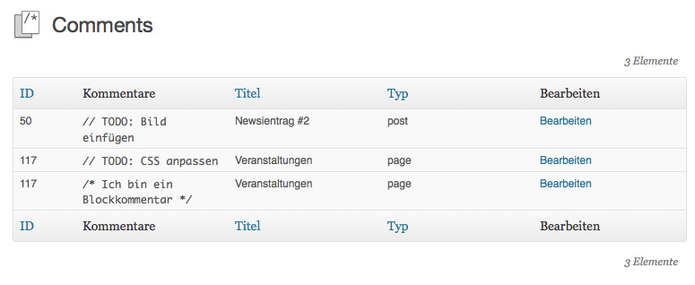

wordpress-content-comments
==========================

This wordpress plugin enables you to use

`// inline comments`

as well as

```/* multiline comments  
    like this one */?```
    
in your wordpress pages' content sections.

The comments will not be displayed on the site, but you can see an overview of all comments on the plugin page. This is primarily useful to note TODOs in content editing.

